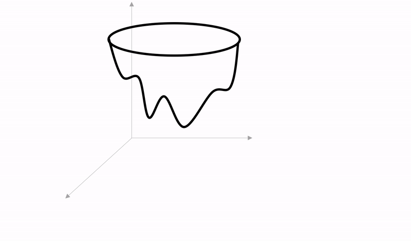
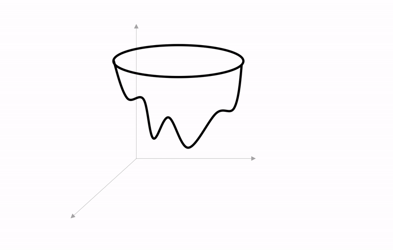
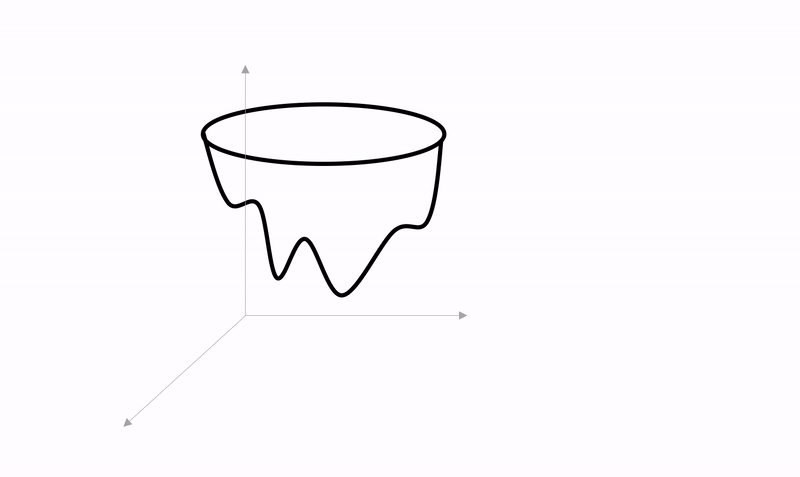

# MXNet Optimizer Overview

MXNet deep learning models are used in lots of different practical applications from image classification to machine translation to speech recognition and many more. While, there are different deep neural model architectures for handling these various applications, from Convolutional Neural Networks for image-based tasks, to Recurrent Neural Networks for tasks with sequential inputs, one thing remains constant - training a deep neural model requires solving an optimization problem, and this is usually acheived with a gradient descent algorithm that iteratively changes the parameters (or weights) of the model.

Put simply, all supervised deep learning models parametrize a function from inputs to output labels. In order to learn the value of the parameters, we start with an initialization scheme and iteratively refine the parameter initial values by moving along a direction that is opposite to the (approximate) gradient of the loss function. This functionality is abstracted by the Optimizer API in MXNet. A single step of iterative refinement of the model parameters is achieved in MXNet by calling `optimizer.step`. This tutorial provides an overview of the various optimizers built-in to MXNet and when to use them.

## Stochastic Gradient Descent
The most commonly used gradient descent algorithm for deep learning tasks is a generalization of stochastic gradient descent. Technically, stochastic gradient descent (sgd) refers to an online approximation of the gradient descent algorithm characterized by calculating the gradient of the loss function applied to a single datapoint, instead of your entire dataset, and using that to update your parameter values. However, in MXNet, and other deep learning frameworks, the sgd optimizer is agnostic to how many datapoints the loss function is applied to and it is quite common to have the sgd update influenced by a mini-batch loss gradient instead of a single datapoint loss gradient. Furthermore, all other MXNet optimizers are based on sgd, with a modified update step.

### sgd optimizer
The sgd optimizer object accepts a construction parameter referred to as the learning rate. This learning rate term is used to determine the step size of the update in the direction opposite to the calculated gradient of the loss function. 

For sgd with learning rate `lr`, the optimizer.step function performs the single update step:

$$w_{i+1} = w_i + lr\cdot -grad(w_i)$$

visualized in the diagram shown below

    

### sgd optimizer with weight decay
The sgd update step can be modified by introducing with an extra term to enforce a penalty on the size of the parameters to ensure small weights. This is achieved by subtracting a fraction of the weight value during the weight update as seen below.

For sgd with learning rate $lr$ and weight decay $\delta$ the optimizer.step function performs the single update step:

$$w_{i+1} = w_i + lr\cdot (-grad(w_i) -\delta\cdot w_i)$$

Introducing weight decay modifies the objective of the optimization problem implicitly with a regularization term that penalizes large weights. Weight decay is discussed more extensively in this [paper](https://papers.nips.cc/paper/563-a-simple-weight-decay-can-improve-generalization.pdf)

### sgd optimizer with momentum
The convergence of the sgd optimizer can also be accelerated by employing momentum. Originally by [Polyak (1964)](https://www.sciencedirect.com/science/article/abs/pii/0041555364901375), the goal of sgd with momentum is to accelerate the convergence of sgd, by improving the approximation of the gradient term by including the gradient terms from previous update steps. In order to achieve this sgd with momentum remembers the update at each iteration to be included in the next iteration and in the equations below we denote the momentum history as $v$. 

For the first update the sgd optimizer with momentum performs the single update step:

$$ v_1= lr\cdot -grad(w_0)$$  
$$ w_1= w_0 + v_1 $$

For subsequent updates, sgd with momentum with momentum parameter $\gamma$ performs the update step:

$$ v_{i+1} = \gamma \cdot v_{i} + lr\cdot -grad(w_{i}) $$
$$ w_{i+1} = w_i + v_{i+1} $$

as seen in the diagram below

    

sgd with momentum was introduced to learning in neural networks by Rumelhart, Hinton and Williams in [Learning Internal Representations by Error Propagation](https://dl.acm.org/citation.cfm?id=104279.104293).

### Nesterov Accelerated Stochastic Gradient Descent

The momentum method of [Nesterov](https://goo.gl/M5xbuX) is a modification to stochastic gradient descent with momentum that allows for faster convergence in practice. With Nesterov Accelerated gradient (nag) descent, the final term to update the weights is derived from the gradient of the loss function with respect to refined parameter values obtained by performing a classical update step with the current momentum used as the update term.  Unlike classical momentum, the gradient of the loss function is **not** taken with respect to the current parameters as in sgd, but with respect to refined parameters.

Alternatively, you can think of the nag optimizer as performing are two update steps. The first (internal) update step uses the current momentum as an approximation of the negative gradient to derive new values for the weights $(w_i + \gamma \cdot v_i)$. This is also known as the lookahead step. The next (external) update step combines the gradient of the loss function with respect to the lookahead parameter values from the first step and the current momentum to obtain a new direction and refine our original parameter values, like classical momentum.

The nag optimizer with momentum parameter $\gamma$ performs the update step:

$$ v_{i+1} = \gamma \cdot v_{i} + lr\cdot -grad(w_{i} + \gamma \cdot v_i) $$ 
$$ w_{i+1} = w_i + v_{i+1} $$

as shown below

    

The effects of using nag over sgd and classical momentum are discussed in this [paper](http://proceedings.mlr.press/v28/sutskever13.pdf) by Sutskever et al

## Adaptive Learning Rate Methods

The gradient methods implemented by the optimizers described above use a global learning rate term for parameter updates. This has a well-documented shortcoming in that it makes the training process and convergence of the optimization algorithm really sensitive to the choice of the global learning rate. Adaptive learning rate methods avoid this pitfall by incorporating some history of the gradients observed in earlier iterations to adaptively scale step sizes to each parameter.

### AdaGrad

The AdaGrad optimizer, which implements the optimization method originally described by [Duchi et al](http://www.jmlr.org/papers/volume12/duchi11a/duchi11a.pdf), scales the global learning rate for each parameter by the $L_2$ norm of the preceeding gradient estimates for that paramater. To achieve this, AdaGrad introduces a new term which we'll denote as $g^2$ - the accumulated square of the gradient of the loss function with respect to the parameters.

Thus the AdaGrad optimizer's `step` function performs the update steps below to obtain $i+1$th refinement

$$ g^2_{i+1} = g^2_{i} + grad(w_i)^2 $$
$$ w_{i+1} = w_i + \dfrac{lr}{\sqrt{g^2 + \epsilon}}\cdot -grad(w_i)$$

The $\epsilon$ term is a tiny positive value introduced to avoid division by zero due to floating point issues.

The overaching benefit of AdaGrad is that it ensures the overall convergence is more resilient to the choice of the global learning rate $lr$ especially in tasks, such as natural language processing some data is sparse and sparse parameters are more informative.

### RMSProp

RMSProp, introduced by [Tielemen and Hinton](http://www.cs.toronto.edu/~tijmen/csc321/slides/lecture_slides_lec6.pdf), is similar to AdaGrad described aboved, but maintains a decaying average of the squared historical gradients for learning rate adaptation, in order to give more weighting to more recent gradients.

For rmsprop, we introduce the term $\mathbb{E}[g^2]$ - the decaying average over past squared gradient and $\beta$ as the forgetting factor. The rmsprop optimizer's step function performs the update give below. 

$$ \mathbb{E}[g^2]_{i+1} = \beta\cdot\mathbb{E}[g^2]_{i} + (1-\beta)\cdot [grad(w_{i})]^2 $$
$$ w_{i+1} = w_i + \dfrac{lr}{\sqrt{\mathbb{E}[g^2]_{i+1} + \epsilon}}\cdot -grad(w_i) $$

The $\epsilon$ term is included, as in AdaGrad, for numerical stability.

The name RMSProp derives from a combination of RProp and the RMS, the root mean square operation in the denominator of the weight update.

#### RMSProp (Centered)
The MXNet rmsprop optimizer with the `centered=True` argument implements a variant of the rmsprop update described by [Alex Graves](https://arxiv.org/pdf/1308.0850v5.pdf), which centres the second moment or decaying average of square gradients by subtracting the square of decaying average of gradients. It also adds an explicit momentum term to weight past update steps. Representing the decaying average of gradients as $\mathbb{E}[g]$ and momentum parameter as $\gamma$, we add another equation to the non-centered rmsprop update described above.

The centered RMSProp optimizer performs the update step:

$$ \mathbb{E}[g]_{i+1} = \beta\cdot\mathbb{E}[g]_{i} + (1-\beta)\cdot [grad(w_{i})] $$
$$ \mathbb{E}[g^2]_{i+1} = \beta\cdot\mathbb{E}[g^2]_{i} + (1-\beta)\cdot [grad(w_{i})]^2 $$
$$ v_{i+1} = \gamma \cdot v_{i} + \dfrac{lr}{\sqrt{\mathbb{E}[g^2]_{i+1} - \mathbb{E}[g]^2_{i+1}+ \epsilon}}\cdot -grad(w_{i}) $$
$$ w_{i+1} = w_i + v_{i+1} $$

### AdaDelta
AdaDelta was introduced to address some remaining lingering issues with AdaGrad and RMSProp - the selection of a global learning rate. While AdaGrad and RMSProp are assign each parameter it's own learning rate, the parameter learning rate is still derived from a supplied global learning rate. AdaDelta does not require a global learning rate and is truly parameter free. Instead, it tracks the square of previous update steps, represented below as $\mathbb{E}[\Delta w^2]$ and uses the root mean square of the previous update steps as an estimate of the learning rate.

The AdaDelta optimizer performs the following equations in it's update steps:

$$ \mathbb{E}[\Delta w^2]_{i+1} = \beta\cdot\mathbb{E}[\Delta w^2]_i + (1 - \beta) \cdot (w_i - w_{i-1})^2 $$
$$ \mathbb{E}[g^2]_{i+1} = \beta\cdot\mathbb{E}[g^2]_{i} + (1-\beta)\cdot [grad(w_{i})]^2 $$
$$ w_{i+1} = w_i + \dfrac{\sqrt{\mathbb{E}[\Delta w^2] + \epsilon}}{\sqrt{\mathbb{E}[g^2]_{i+1} + \epsilon}} \cdot -grad(w_i)$$

As evident from the above equations, AdaDelta is similar to RMSProp but does not require you to specify $lr$ but instead uses $\sqrt{\mathbb{E}[\Delta w^2] + \epsilon}$ as the estimated learning rate. AdaDelta was introduced by Zeiler in this [paper](https://arxiv.org/abs/1212.5701).

### Adam
Adam, introduced by [Kingma and Ba](https://arxiv.org/abs/1412.6980), is one of the popular adaptive algorithms for deep learning. It combines elements of RMSProp with momentum sgd. Like RMSProp, Adam uses the RootMeanSquare of decaying average of historical gradients but also explicitly keeps track of a decaying average of momentum and uses that for the update step direction. Thus, adam accepts two hyperparameters $\beta_1$ and $\beta_2$ for momentum weighting and gradient RMS weighting respectively. Adam also accepts a global learning rate that's adaptively tuned to each parameter with the gradient RootMeanSquare. Finally, Adam also includes bias correction steps within the update that transform the biased estimates of first and second order moments, $v_{i+1}$ and $\mathbb{E}[g^2]_{i+1}$ to their unbiased counterparts $\tilde{v}_{i+1}$ and $\tilde{\mathbb{E}[g^2]}_{i+1}$

The Adam optimizer performs the update step described the following equations:

$$ v_{i+1} = \beta_1 \cdot v_{i} + (1 - \beta_1) \cdot grad(w_i) $$
$$ \mathbb{E}[g^2]_{i+1} = \beta_2\cdot\mathbb{E}[g^2]_{i} + (1-\beta_2)\cdot [grad(w_{i})]^2 $$ 
$$ \tilde{v}_{i+1} = \dfrac{v_{i+1}}{1 - (\beta_1)^{i+1}} $$
$$ \tilde{\mathbb{E}[g^2]}_{i+1} = \dfrac{\mathbb{E}[g^2]_{i+1}}{1 - (\beta_2)^{i+1}} $$
$$ w_{i+1} = w_i + \dfrac{lr}{\sqrt{\tilde{\mathbb{E}[g^2]}_{i+1}} + \epsilon} \cdot -\tilde{v}_{i+1} $$
 
 
### AdaMax
AdaMax is a variant of Adam also included in the original paper by [Kingma and Ba](https://arxiv.org/abs/1412.6980). Like Adam, AdamMax maintains a moving average for first and second moments but AdaMax uses the $L_{\infty}$ norm to keep track of the second moment, instead of the $L_2$ norm used in adam. The $L_{\infty}$ norm of a vector is equivalent to take the maximum absolute value of elements in that vector.

$$ v_{i+1} = \beta_1 \cdot v_{i} + (1 - \beta_1) \cdot grad(w_i) $$
$$ g^\infty_{i+1} = \mathtt{max}(\beta_2\cdot g^\infty_{i},  |{grad(w_i)}|) $$
$$ \tilde{v}_{i+1} = \dfrac{v_{i+1}}{1 - \beta_1^{i+1}} $$
$$ w_{i+1} = w_i + \dfrac{lr}{g_{i+1} + \epsilon} \cdot - \tilde{v}_{i+1} $$

### NAdam
NAdam is also a variant of Adam and draws from the perspective that Adam can be viewed as a combination of RMSProp and classical Momentum (or Polyak Momentum). NAdam replaces the classical Momentum component of Adam with Nesterov Momentum (See [paper](http://cs229.stanford.edu/proj2015/054_report.pdf) by Dozat). The consequence of this is that the gradient used to update the weighted average of the momentum term is a lookahead gradient as is the case with nag

The NAdam optimer performs the update step:

$$ v_{i+1} = \beta_1 \cdot v_{i} + (1 - \beta_1) \cdot grad(w_i + \beta_1 \cdot v_{i}) $$
$$ \mathbb{E}[g^2]_{i+1} = \beta_2\cdot\mathbb{E}[g^2]_{i} + (1-\beta_2)\cdot [grad(w_{i})]^2 $$
$$ \tilde{v}_{i+1} = \dfrac{v_{i+1}}{1 - \beta_1^{i+1}} $$
$$ \tilde{\mathbb{E}[g^2]}_{i+1} = \dfrac{\mathbb{E}[g^2]_{i+1}}{1 - \beta_2^{i+1}} $$
$$ w_{i+1} = w_i + \dfrac{lr}{\sqrt{\tilde{\mathbb{E}[g^2]}_{i+1}} + \epsilon}\cdot - \tilde{v}_{i+1} $$

## SGD optimized for large scale distributed training

Training very deep neural networks can be time consuming and as such it is very common now to see practitioners turn to distributed training on multiple processors on the same machine or even across a fleet of machines to parallelize network training because distributed training can reduce neural network training time from days to minutes.

While all the preceeding optimizers, from sgd to adam, can be readily used, synchronously or asynchronously, in the distributed training setting, the following optimizers in mxnet provide extra features targeted at alleviating some of the problems associated with distributed training.

### Signum
In distributed training communicating full precision gradients across multiple workers nodes can be expensive and have a performance bottleneck, the Signum optimizer addresses this problem by transmitting just the sign of each minibatch instead of the full precision gradient. The signum optimizer in mxnet implements two variants of compressed gradients described in the paper by [Bernstein et al](https://arxiv.org/pdf/1802.04434.pdf).

The first variant, achieved by constructing the Signum optimizer with `momentum=0`, implements SignSGD which performs the update below.

$$ w_{i+1} =  w_i - lr \cdot sign(grad(w_i)) $$

The second variant, achieved by passing a non-zero momentum parameter implements the Signum update which is equivalent to SignSGD and momentum. For momentum parameter $0 < \gamma < 1 $, the `step` of the Signum optimizer performs the following update:

$$ v_{i+1} = \gamma \cdot v_i + (1 - \gamma) \cdot grad(w_i) $$
$$ w_{i+1} =  w_i - lr \cdot sign(v_{i+1}) $$

### LBSGD
LBSGD stands for Large Batch Stochastic Gradient Descent and implements a technique where Layer-wise Adaptive Rate Scaling (LARS) is used to maintain a separate learning rate for each layer of the neural network. LBSGD has no additional modifications to sgd and performs the same parameter update steps as the sgd optimizer described above.

LBSGD was introduced by [You et al](https://arxiv.org/pdf/1708.03888.pdf) for distributed training with data-parallel synchronous sgd across multiple worker nodes to overcome the issue of reduced model accuracy when the number of workers, and by extension effective batch size, is increased.

### DCASGD

The DCASGD optimizer implements Delay Compensated Asynchronous Stochastic Gradient Descent by [Zheng et al](https://arxiv.org/pdf/1609.08326.pdf). In asynchronous distributed sgd, it is possible that a worker add its gradients too late to the global (parameter) server resulting in a delayed gradient being used to update the current parameters. DCASGD addresses this issue of delayed gradients by compensating for this delay in the parameter update steps.

If $grad(w_i)$ denotes the delayed gradient, $w_{i+\tau}$ denotes the parameter values at the current iteration, and $\lambda$ is the delay scale factor, the DCASGD optimizer `step` function performs the update:

$$ w_{i+\tau+1} = w_{i+\tau} − lr \cdot (grad(w_i) + \lambda \cdot grad(w_i)^2 \cdot (w_{i+\tau} − w_i)) $$

## Online Learning Algorithms

### FTRL

FTRL stands for Follow the Regularized Leader and describes a family of algorithms originally designed for online learning tasks. 

For each parameter update step ftrl algorithms finds the next parameter by solving the following optimization problem which minimizes the inner product of new parameter and all preceding gradients and the $L2$ norm on the distance from the new parameter values to all preceding parameter values:

$$ w_{i+1} = \texttt{argmin}_{w} \sum_{j=1}^{i} grad(w_i) \cdot w + \dfrac{1}{2}\sum_{j=1}^{i} \sigma_j \cdot ||w - w_j||_2^2 + \lambda ||w||_1$$

However due to the similarity of online learning and neural network training, there is an [equivalence](https://static.googleusercontent.com/media/research.google.com/en//pubs/archive/37013.pdf) between variants of gradient descent and ftrl algorithms. In fact, FTRL with only $L_2$ regularization (i.e $\lambda$ in the equation above is set to 0) is exactly stochastic gradient descent.

The version of FTRL implemented as an mxnet optimizer is from [McMahan et al](https://static.googleusercontent.com/media/research.google.com/en//pubs/archive/41159.pdf) and encourages sparse parameters due to $L_1$ regularization.  It's `step` function performs the update:

$$ z_{i+1} = z_i + grad(w_i) + (\dfrac{1}{lr_i} - \dfrac{1}{lr_{i-1}}) \cdot w_i $$
$$ w_{i+1} = (|z_{i+1}| > \lambda) \cdot [ -lr_i (z_{i+1} - sign(z_{i+1})\cdot\lambda)] $$

### FTML

FTML stands for Follow the Moving Leader and is a variant of the FTRL family of algorithms designed to improve a major shortcoming of FTRL algorithms in optimizing non-convex loss functions in deep learning. FTRL algorithms, described above, solve an optimization problem every update that involves the sum of all previous gradients. However, in the non-convex settings, older gradients are likely uninformative as the parameter updates can move to converge towards different local minima at different iterations. FTML addresses this problem by reweighing the learning subproblems in each iteration.  According to [Zheng et al](http://proceedings.mlr.press/v70/zheng17a/zheng17a.pdf), FTML enjoys some of the nice properties of RMSProp and Adam while avoiding their pitfalls.

The FTML optimizer's `step` function performs the following update:

$$ v_{i+1} = \beta_2 \cdot v_i + (1 - \beta_2) \cdot grad(w_i)^2$$
$$ d_{i+1} = \dfrac{1 - \beta_1^{i+1}}{lr} \big(\sqrt{\dfrac{v}{1 - \beta_2^{i+1}}} + \epsilon\big)$$
$$ z_{i+1} = \beta_1 \cdot z_{i+1} + (1 - \beta_1)\cdot grad(w_i) - (d_{i+1} - \beta_1 \cdot d_i) \cdot w_i$$
$$ w_{i+1} = \dfrac{-z_{i+1}}{d_{i+1}} $$

## Bayesian SGD

### SGLD
Stochastic Gradient Langevin Dynamics or SGLD was introduced to allow uncertainties around model parameters to be captured directly during model training. With every update in SGLD, the learning rate decreases to zero and a gaussian noise of known variances is injected into the sgd step. This has the effect of having the training parameters converge to a sufficient statistic for a posterior distribution instead of simply a point estimate of the model parameters.

SGLD performs the parameter update:

$$ w_{i+1} = w_i + \dfrac{lr_{i+1}}{2}\cdot -grad(w_i) + \eta_{i+1}$$

where $ \eta_{i+1} \sim N(0, lr_{i+1})$ i.e $\eta_{i+1}$ is drawn from a zero centered gaussian with variance $lr_{i+1}$

SGLD was introduced by [Patterson and Teh](https://papers.nips.cc/paper/4883-stochastic-gradient-riemannian-langevin-dynamics-on-the-probability-simplex.pdf).